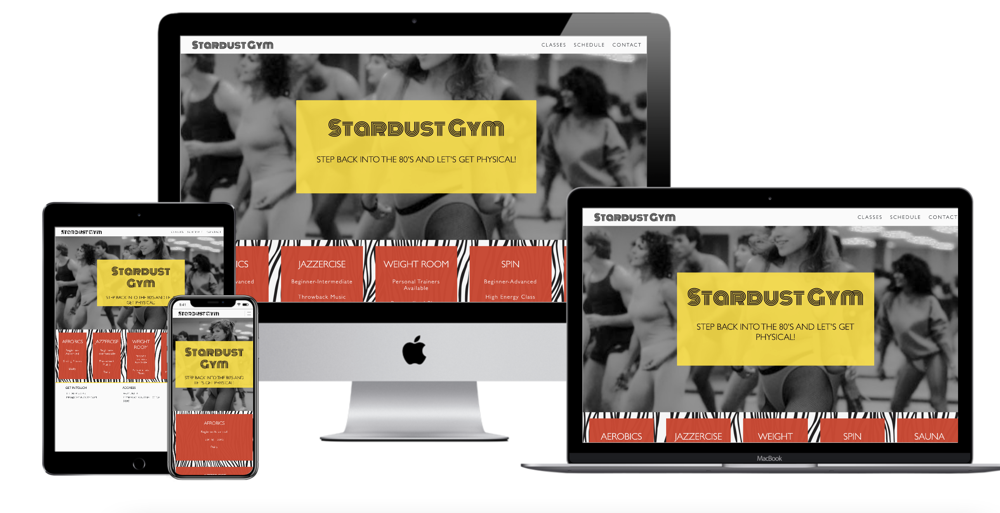

# Stardust Gym
—
The Stardust Gym website aims to attract a clientele looking for a fun workout with 80’s style aerobics with easy accessibility to sign up for classes and membership. This is a responsive website for a gym including a welcome page with a brief overview of what the gym offers, a page describing available amenities and classes, a pdf class schedule and an intuitive sign-up/contact form. The objective of the website is to attract members using modern design with a fun 80’s analog influence with vintage photos and prints whilst being very easy to navigate and user-friendly. Using HTML, CSS and Bootstrap to develop an attractive and engaging site, I aim to provide an accessible platform for potential clients and current members to use to contact the gym, see what’s new and check the schedule and potentially book classes.

[You can view the live project here](https://emmasarge.github.io/stardustgym/)

## Contents 
---
* UX
  * Project Goals
  * User Goals
  * Business Goals
  * User Requirements
  * Planning & Design
    * Layout & Wireframes
    * Colors
    * Icons
    * Fonts

* Technologies 
  
* Features
  * Current
  * Future 

* Testing 

* Bugs

* Deployment 
  * Method
  
* Credits

# UX #
---
### Project Objectives 
---
  1) Attract potential members of the gym.
  2) Provide useful information for members and potential members of Stardust Gym.
  3)Provide an attractive and visual web experience to build a community at Stardust Gym, provide a positive ethos and service. 

### User Goals 
---
As a potential member of Stardust Gym I want:
  * Website reflects the quality of the gym to trust their reputation from first impression.  
*I want to know what the gym provides in terms of classes, amenities and ethos.
*I want to know how to contact the gym.
*I want to know the class schedule.
*I want to be able to have a pdf of the class schedule so I can easily print it or send it to a friend.
*I want to be able to easily navigate their website. 
* Website that works on phone, tablet and desktop to accommodate my busy lifestyle.
* It is very easy to contact the gym via the site.
* I want to know how I can visit the gym’s social media channels.
* I want to know the gym provides a positive experience for fitness to try something new.

### Business Goals
---
*The website should provide an accessible method for members and potential members to contact the gym. 
*The gym wants to provide a positive environment for people who are new or familiar with fitness and the website should reflect this.
*The website should easily offer a weekly schedule to increase site visitors to return to the site and check the classes to share with their friends.

### User Requirements 
---
1) Responsive design for mobile/tablet/desktop.
2) Simple and intuitive layout and design of the website, UX is efficient.
3) Provides social media links.
4) Provides contact information and address.
5) Provides a very easy-to-use contact form.
6) Site works on a variety of browsers.
7) Design of site reflects the quality of the gym, modern and approachable.

### Planning and Design
---
##Layout & Wireframes
  
Skeleton 

I created my wireframes initially on paper with pen and then onto Balsamiq. They aren’t the most detailed and I would like to improve on this for any future projects.
 

#### Home Page        
* [Home page desktop](wireframes/home-page-desktop.png)
* [Home page tablet](wireframes/home-page-tablet.png)
* [Home page mobile](wireframes/home-page-mobile.png)
​
#### Classes
* [About page desktop](wireframes/class-page-desktop.png)
* [About page tablet](wireframes/class-page-tablet.png)
* [About page mobile](wireframes/class-page-mobile.png)
​
#### Contact
* [Portfolio page desktop](../wireframes/contact-page-desktop.png)
* [Portfolio page tablet](../wireframes/contact-tablet.png)
* [Portfolio page mobile](../wireframes/contact-page-mobile.png)
​

### Colors

I applied a clean and warm color scheme to Stardust Gym’s website.

For the navbar, footer and background I used a warm off-white called #fafafa which I learned about from the Code Institute course create a clean effect without being too cold and bright. The warmth of this white is more modern and easy on the eyes. The light color brings the navigation links and footer to the attention to the site visitor to enhance UX.

I based the rest of the site’s color scheme on an old ad I found from the 80’s and used a color picker from ColorZilla to match tones. I wanted to maintain an analogue and modern feel so I used grey, black, red and yellow. 

Black: #1a0f17
Yellow: rgb(255, 225, 0)
Red: #d73b27
Off-white: #fafafa

### Images 
   * With a strong 1980’s theme for the entire concept of Stardust Gym, I maintained the vintage aesthetic by using images from the 1980’s juxtaposed with a clean and modern design. To achieve the genuine 1980’s feel, there is a grainy film quality of the black and white images which are used behind text to achieve the clean and bright design similar to 1980’s advertisements. I found all of my images via Google image search looking specifically for 1980’s aerobics class, 1980’s weight workout.
 
### Fonts
*Initially I was looking for an 80’s neon sign-like font but found a cleaner font called Monoton from Google Fonts. I paired this with a very clean and classic Gill Sans for the body text. I wanted to maintain a crisp and modern appearance to the overall site and decided to work with just two fonts to achieve this.

### Technologies Used
---
  ## Technologies Used 

*[HTML5](https://en.wikipedia.org/wiki/HTML5) 

*[CSS3](https://en.wikipedia.org/wiki/CSS) for site styling

*[Bootstrap](https://getbootstrap.com/) for navbar and page layouts.
 
*[Google Fonts](https://fonts.google.com/) for the MONOTON font. 

*[Git](https://git-scm.com/)

*[Gitpod](https://www.gitpod.io/) for site development 

*[Github](https://github.com/) for site deployment.

*[Techsini](https://techsini.com/multi-mockup/index.php) for mock-up mobile/tablet/desktop images

*[Balsamiq](https://balsamiq.com) for wireframes.

### For testing:

*[W3C for HTML](https://validator.w3.org/)  

*[W3C for CSS](https://jigsaw.w3.org/css-validator/)  

### Features
---
*Navigation bar
*Responsive links opening in new tabs.
*Brand Logo
*Footer
*Responsive elements for Desktop, tablet and mobile.
*An intuitive sign-up form. 
*Call to action buttons
*Downloadable pdf with class schedule
*Images

### Future Features

I would like to add a booking element for site visitors to book and pay for a class adhoc. I would also like to add some video elements and a blog with upcoming offers and workout tips, this page would be exclusive to members who are signed in with their username to the site. I would also like to improve the SEO and maintain a simple and efficient design and content.

### Testing 
---
*  Development testing 
    *I intermittently used [Google Dev Tools](https://developers.google.com/web/tools/chrome-devtools) to double check coding for all responsive layouts.
*  Validation testing to double check coding accuracy was done with:
  1) [W3S CSS Validator](https://jigsaw.w3.org/css-validator/) 
  2) [W3S Html Validator](https://validator.w3.org/)  
    * This resulted in a change to a single page scrolling website with navigation leading to the differnt sections of the page.  
*  Validation testing was taken out using;
  1) [W3S CSS Validator](https://jigsaw.w3.org/css-validator/) 
  2) [W3S Html Validator](https://validator.w3.org/) 
 * Sent friends and family link to site to check on their variety of devices including:
		* Apple iPhone 6, XS, 12
		* Apple iPad 5th Generation
   		* Samsung Galaxy
		* Lenovo Laptop
		* Apple MacBook Pro
		* Apple MacBook Air

### Feedback from Testing Users

* The contact page heading doesn’t adapt to a smaller screen. ‘Membership’ falls beyond the lines of its display box. **FIXED**
* List pricing on the page.
* Include a blog or a page for news for the gym.
* The red text boxes on the homepage are too transparent against the zebra print for the text to be readable. **FIXED**
* The schedule pdf is not loading. **FIXED**
* Commit changes more often and be more specific. **IN PROGRESS** 

### Bugs
---
    * The schedule page pdf is not opening. Solution: Remove the …/ to the href before assets.
    * Navbar not collapsing cleanly for mobile and tablet settings. Redid the navbar with bootstrap.
    * Contact page heading is not adjusting to fit for small mobile screens. Solution: Changed font style to Gill sans and changed font size.

### Deployment 
---
#### GitHub Pages

To deploy this project with Github:
1) On Github go to the Stardust Gym repository. 
3) Under the Stardust Gym repository name, click  Settings.
4) Scroll down the page to find the “GitHub Pages” section. 
5)  Use the drop-down menu to select a folder for your publishing source and choose 'Master'. 
6) Refresh the page to confirm the site is published where you will see the notification highlighted in green.

#### Forking the GitHub repository

To make a copy of the repository:
1) Log into GitHub
2) Click the ‘Settings’ option, the ‘Fork’ option is on top right of this page.  
3) Click on ‘Fork’ to make a copy of the original repository. 
  
## Credits

### Content was written by Emma Sargeant

### Media 
Photos were found via Google Image search:

[Hero Image] (https://flashbak.com/10-reasons-aerobics-in-the-1980s-was-crazy-awesome-76/)
[Contact Page](https://img.mensxp.com/media/content/2017/Mar/golden-era-bodybuilders-who-defined-the-sport-of-bodybuilding-along-with-arnold-schwarzenegger980-1489757302_600x280.jpg)
[Background Patterns](https://www.freepik.com/vectors/80s-pattern)
[Background Zebra Print](https://www.istockphoto.com/illustrations/zebra-pattern?phrase=zebra%20pattern&sort=best)

### References for Code

* The homepage was based on the Love Running project from the Code Institute, particularly the nav and footer. 

### Acknowledgements

* I would like to thank Jim_Lynx from the CodeAcademy Slack group for his support and help.
* I would like to thank the Code Institute for the knowledge shared.

